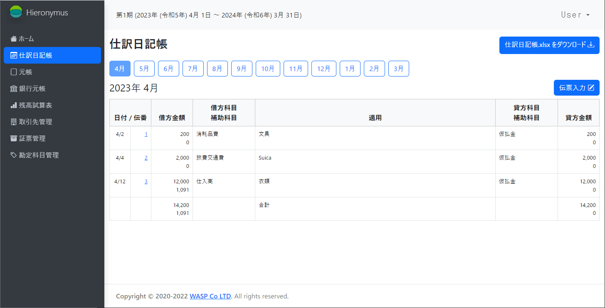
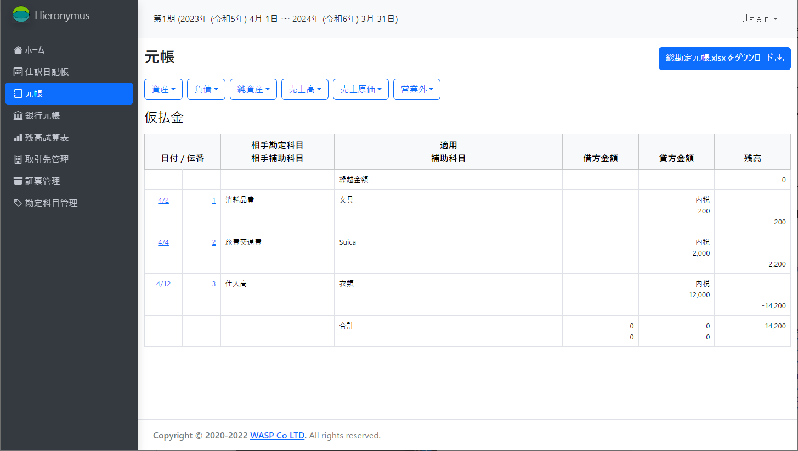
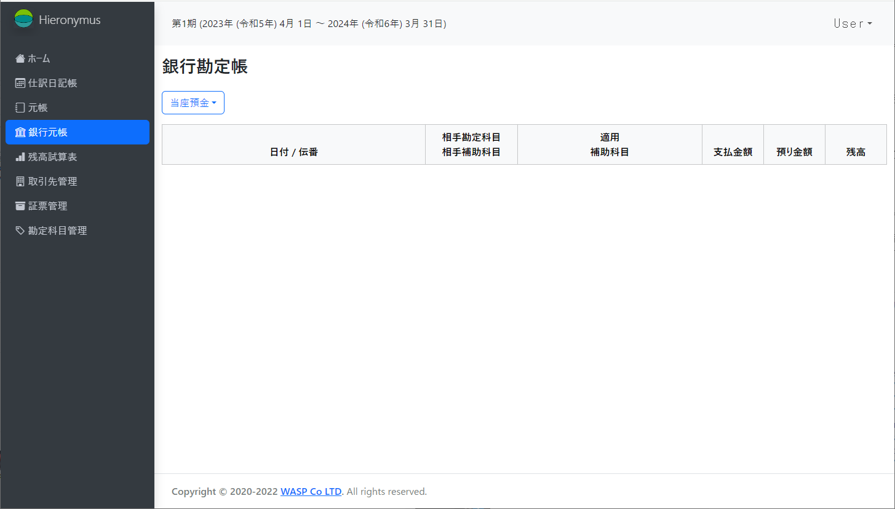
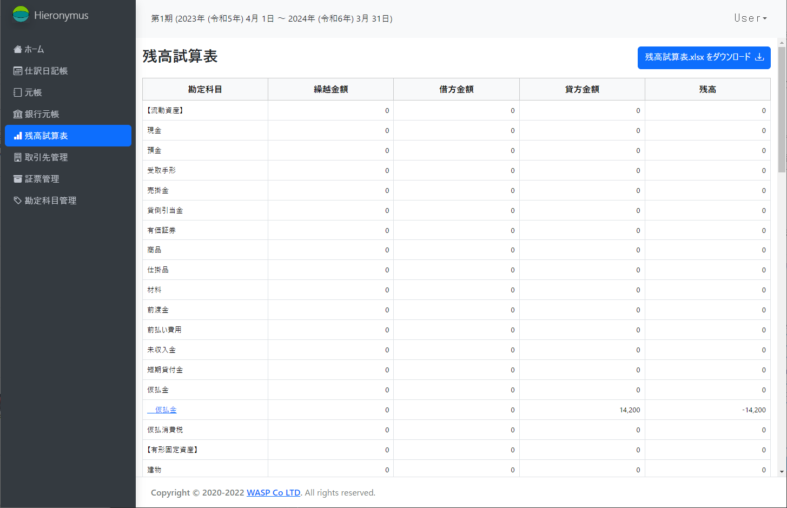
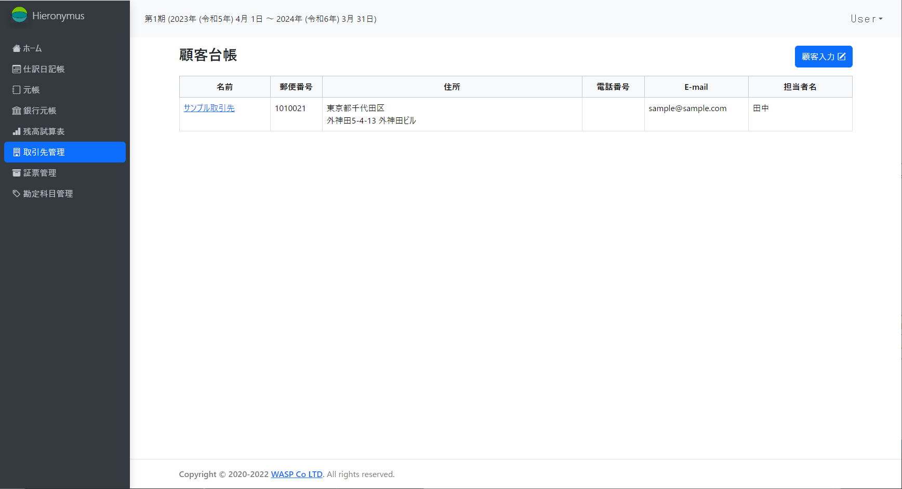
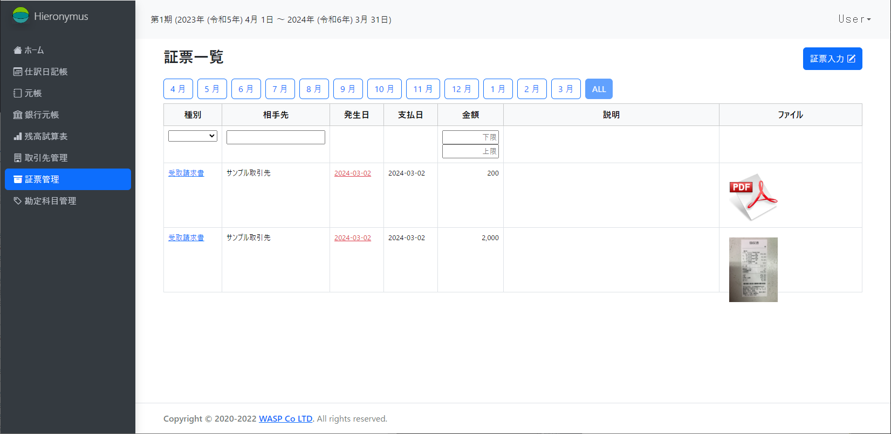

# Hieronymus


Hieronymusは零細企業用のERPシステムです。

現在のところ

* 基本的な会計機能(財務会計)
* 取引先の基本的な管理機能
* 新電帳法対応の証票管理機能

が実装されています。

## インストール方法

Hieronymusは2つのインストール方法を提供しています。

* ソースコードからインストール
* Dockerを使用したインストール

### ソースコードからインストール

HieronymusはDBにPostgresを使用します。あらかじめインストールしてからHieronymusのインストールを行ってください。

1. ソースコードの取得
```
$ git clone https://github.com/waspcojp/hieronymus.git
```
2. 設定ファイルの作成
```
$ cd hieronymus
$ cp config/config.json.sample config/config.json
```
config/config.jsonはDBの接続情報です。usernameやpassword等自身の環境に合わせて編集してください。

3. セットアップ

```
$ export NODE_ENV=production
$ npm install
$ npm run build-production
$ npx sequelize-cli db:create
$ npx sequelize-cli db:migrate
```
4. 起動
```
$ npm run start
```
デフォルトでは3010番ポートで動きます。

### Dockerを使用したインストール
```
$ git clone https://github.com/waspcojp/hieronymus.git
$ cd hieronymus
$ docker compose up
```
しばらくすると、3010番ポートから利用を開始できます。

## 使い方

初期アカウント等は設定されていません。
初期ログインの時に自分でユーザ登録を行ってから使って下さい。

## 機能

### 仕訳日記帳
伝票入力等の基本画面です。  
入力した伝票の閲覧、伝票の入力(修正)が可能です。




### 元帳
総勘定元帳と補助元帳が複合した画面です。  
科目及び補助科目毎の明細が表示されます。  
ここから直接伝票を修正することも可能です(新規入力はできません)。



### 銀行元帳

基本的には元帳画面と同じですが、預金通帳を模した表示となっています。  
主には会計データと預金通帳の整合を確認するためのものです。



### 残高試算表

残高試算表が確認できます。



### 取引先管理

会計システムに出現する取引先を登録します。  
この情報は、次の**証票管理**で使われます。  
将来的には、CRM機能として発展させる予定です。



### 証票管理

電子化証票を登録できます。  
ここで登録した証票は、伝票入力の時に結合させることができます。
伝票に証票が結合された場合、伝票明細が表示される画面で参照(ダウンロード)が可能になります。



### 勘定科目管理

勘定科目を追加変更ができます。「削除」はできません。


## その他

プルリク待ってますｗ
